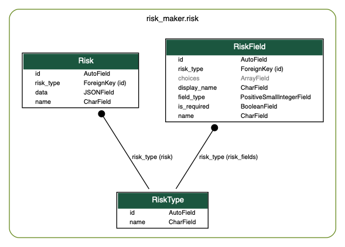

# Risk Maker

> App that allows insurers to define their own custom data model for their risks


## Database Design

To enable the custom data model for Risks, I have gone for a slightly unconventional approach. I have relied on 
Postgres' JSONField for a "schemaless" feel to the dynamic Risk Types.

RiskField model holds the detail of each fields that are part of each RiskType. It has a field_type IntegerField 
which represents the four choices: Text, Number, Date and Choice. It also has name, display_name and 
is_required fields for keeping more details for the field to be added. For risk_type of Choice, it can also 
store the possible choices in an ArrayField.

The RiskType model has a name field and has a OneToMany relationship with RiskField. So each RiskType can 
have many RiskFields. 

The Risk model stores it's name and risk_type ForeignKey and in the data, JSONField stores the subsequent 
data that is representative of the RiskFields that belong to it's RiskType. All the validation for the data field 
are done at the API level.





## API Endpoints

#### GET /api/v1/risk-types/{id}/

Retrieve Endpoint for RiskType. Returns the RiskType data for {id} along with nested details of risk_fields.


Sample response:
```json
{
    "id": 1,
    "name": "Baby Hair",
    "risk_fields": [
        {
            "id": 4,
            "name": "description",
            "display_name": "Description",
            "field_type": 0,
            "is_required": true,
            "choices": []
        },
        {
            "id": 3,
            "name": "no_of_hair",
            "display_name": "# of Hair",
            "field_type": 1,
            "is_required": true,
            "choices": []
        },
        {
            "id": 2,
            "name": "dob",
            "display_name": "Date of Birth",
            "field_type": 2,
            "is_required": true,
            "choices": []
        },
        {
            "id": 1,
            "name": "hair_color",
            "display_name": "Hair Color",
            "field_type": 3,
            "is_required": true,
            "choices": [
                "red",
                "green",
                "blue"
            ]
        }
    ]
}
```


#### POST /api/v1/risks/

POST Risk Endpoint. Endpoint for creating a Risk item of a certain risk_type.


Sample Request
```json
{
    "risk_type": 1,
    "name": "Elvis Presley",
    "data": {
        "description": "The Next King of Rock and Roll",
        "no_of_hair": 1024,
        "dob": "2010-01-01",
        "hair_color": "red"
    }
}
```


Sample Response
```json
{
    "id": 1,
    "risk_type": 1,
    "name": "Elvis Presley",
    "data": {
        "description": "The Next King of Rock and Roll",
        "no_of_hair": 1024,
        "dob": "2010-01-01",
        "hair_color": "red"
    }
}
```


## Note

Only 2 APIs have been exposed as part of the task requirements. RiskType and subsequent RiskFields needs to be created
via the Django Admin Panel. For simplicity created_by, created_at and such related data have not been handled 
here. 


## Getting Started


### Prerequisites

- Docker
- Docker Compose


### Installing

Clone the project and then cd into the project directory from the terminal. Run the following command.
```
$ docker-compose up --build
```

## Running the tests

On another terminal, run the following commands.

```
$ docker-compose exec web bash
# pytest -v
```


## Deployment

The dokkufy branch of this project is deployed to http://157.230.35.253:3333 using Dokku